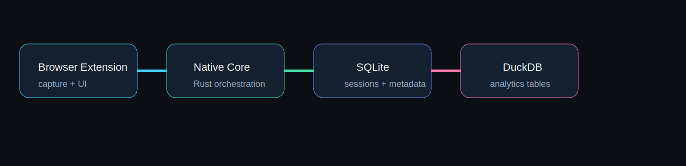

<div align="center">
<<<<<<< HEAD
  
=======
  
>>>>>>> 013bf17 (update)
</div>

# DockStack

<<<<<<< HEAD
**DockStack** is a local-first browser data workspace built for serious capture, inspection, extraction, and export workflows.

It combines a **WXT + React + TypeScript extension**, a **Rust native core**, **SQLite** for operational storage, **DuckDB** for analytics and extraction tables, and **local AI hooks** for **Ollama / llama.cpp**.

> Goal: capture what sites actually load, store it safely, analyze it locally, and export useful datasets without depending on paid cloud APIs.

---

## Why DockStack exists

Most scraping tools focus only on HTML and selectors. DockStack is designed around a stronger idea:

- capture the **real network activity** modern apps use
- inspect **rendered page state** where needed
- keep data **local-first**
- make extraction **repeatable**
- support **sensitive-mode controls** instead of pretending secrets do not exist

DockStack is meant to become a serious developer and analyst tool, not a toy popup.

---

## Core capabilities in this repository

### Capture
- page-level `fetch` interception
- page-level `XMLHttpRequest` interception
- session-based capture workflow
- current-tab / domain / workspace capture scopes
- local background pipeline for ingesting records
- extension-native staging of recent captures

### Storage
- **SQLite** for:
  - sessions
  - capture indexes
  - operational state
  - metadata and preferences
- **DuckDB** for:
  - analytics-friendly materialization
  - queryable flattened capture data
  - future structured extraction tables

### Export
- JSON export
- CSV export
- foundation for future richer session bundles

### Sensitive-data controls
- explicit consent gate for sensitive mode
- masked-by-default secret policy in Rust core
- local-first architecture to avoid unnecessary remote exfiltration

### Local AI hooks
- local Ollama endpoint integration scaffold
- future-compatible llama.cpp/local inference path
- analysis request path from extension to native core

---

## Architecture overview

<div align="center">
  
</div>

<div align="center">
  
</div>
### High-level flow
1. The **extension** captures network or page-level events.
2. The **background worker** normalizes messages.
3. The **native Rust core** receives events over native messaging.
4. **SQLite** stores operational records.
5. **DuckDB** materializes analytics/query-ready rows.
6. The **export engine** writes JSON/CSV artifacts.
7. Optional **local AI** analyzes context through Ollama.

---
=======
DockStack is a **local-first browser capture and extraction workspace** for modern web applications.
>>>>>>> 013bf17 (update)

It is built for the cases where page HTML is not the real source of truth and the useful data actually lives in:

<<<<<<< HEAD
### Extension / frontend
- TypeScript
- React
- WXT

### Native core
- Rust

### Databases
- SQLite
- DuckDB

### Local AI
- Ollama
- llama.cpp integration path

### CI / automation
- GitHub Actions

=======
- JSON API responses
- GraphQL payloads
- fetch / XHR traffic
- authenticated application flows
- rendered client-side interfaces

DockStack combines a **WXT + React + TypeScript extension**, a **Rust native core**, **SQLite**, **DuckDB**, and **local AI hooks** for **Ollama / llama.cpp**.

>>>>>>> 013bf17 (update)
---

## Product position

<<<<<<< HEAD
```text
DockStack/
  apps/
    extension/          # WXT + React + TypeScript browser extension
    native-core/        # Rust native messaging host
  crates/
    capture-core/       # shared Rust capture models
    storage-sqlite/     # operational data store
    storage-duckdb/     # analytics/materialization store
    export-engine/      # JSON/CSV export logic
    ai-engine/          # Ollama bridge
    secret-policy/      # masking and sensitive-data rules
  packages/
    shared-types/       # shared TS types/protocols
  assets/               # project images
  docs/
    architecture.md
  scripts/
    install-native-host.sh
```

---
=======
DockStack is not trying to be a toy popup scraper.

It is being built as a serious local workstation for:
- capture
- inspection
- extraction
- structured dataset discovery
- export
- release-grade local storage and processing

The design goal is simple:

> capture what the site really loads, keep the data local, make it inspectable, and turn it into usable output.

---

## What ships in this repository today

### Capture pipeline
- page-level `fetch` interception
- page-level `XMLHttpRequest` interception
- extension background ingest flow
- session-based capture handling
- tab / domain / workspace scope controls

### UI surfaces
- capture control panel
- session history panel
- recent capture table
- full request detail inspector
- dataset candidate detection panel
- structured dataset preview panel
- local analysis trigger path

### Native core
- native messaging host
- session persistence
- capture persistence
- masking policy enforcement
- export handling
- local Ollama request path

### Storage
- **SQLite** for operational application state and capture records
- **DuckDB** for analytics-oriented materialization and future extraction workloads

### Export
- JSON session export
- CSV session export

---

## Architecture

<div align="center">
  
</div>

<div align="center">
  
</div>

### Runtime model
1. the browser extension captures traffic and page events
2. the background worker normalizes capture events
3. the native Rust host receives those events over native messaging
4. SQLite stores operational records
5. DuckDB materializes data for analysis and structured extraction workflows
6. export routines generate release-grade artifacts
7. local AI hooks can analyze candidate datasets without requiring paid cloud APIs

---

## Technology stack

### Extension / frontend
- TypeScript
- React
- WXT

### Native processing core
- Rust

### Storage
- SQLite
- DuckDB

### Local AI
- Ollama
- llama.cpp integration path

### CI and release automation
- GitHub Actions

---

## Repository layout

```text
DockStack/
  apps/
    extension/          # Browser extension (WXT + React + TS)
    native-core/        # Native messaging host (Rust)
  crates/
    capture-core/       # Shared Rust capture models
    storage-sqlite/     # SQLite store
    storage-duckdb/     # DuckDB store
    export-engine/      # Export logic
    ai-engine/          # Ollama bridge
    secret-policy/      # Masking and sensitive-data rules
  packages/
    shared-types/       # Shared TypeScript types
  assets/               # README visuals
  docs/                 # Architecture, security, native-host, development docs
  scripts/              # Native host install helpers
```

---

## Release model

DockStack now includes:
- **CI workflow** for build validation
- **release workflow** for tagged releases and release assets

### Versioning
Releases start at:
- `v0.1.0`

After that, the workflow increments using a **semantic patch version**:
- `v0.1.1`
- `v0.1.2`
- `v0.1.3`

This is intentional.

`0.1.01` is not valid semantic versioning style, so DockStack uses standard patch increments.

### Release assets
The release workflow is designed to publish:
- packaged Chrome extension zip
- Linux x64 native core bundle
- release metadata and notes

---

## Security stance

DockStack is designed to be **local-first** and **consent-aware**.

### Current controls
- sensitive capture is disabled by default
- the user must explicitly accept sensitive capture terms
- common secret-bearing headers are masked before persistence
- export is an explicit action, not a hidden background upload

### Current masked headers
- `authorization`
- `cookie`
- `set-cookie`
- `x-csrf-token`
- `x-xsrf-token`
- `csrf-token`

### Important note
This repository contains a real security-minded foundation, but it should not be described as a formally audited high-assurance security tool yet.

---

## Native host

DockStack uses a native host because heavy local work does not belong inside the browser runtime.

That host is responsible for:
- persistence
- policy enforcement
- export generation
- local AI dispatch
- future heavy query and replay workloads

For details, see:
- [Native host notes](docs/native-host.md)

---

## Build and development

### Requirements
- Node.js 20+
- pnpm 9.12.0
- Rust stable
- desktop Chromium browser for extension testing
- optional local Ollama installation
>>>>>>> 013bf17 (update)

## Current extension surfaces

### Popup
Current repository includes a functional popup for:
- starting a capture session
- stopping a capture session
- enabling sensitive mode
- accepting sensitive capture terms
- viewing recent captures
- checking native-core connectivity

### Content script
The extension injects a page-level hook that captures:
- `fetch`
- `XMLHttpRequest`

### Background worker
The background worker:
- receives capture events
- binds them to the active session
- persists recent local records
- forwards them to the Rust native core

---

## Native core responsibilities

The Rust native core currently owns:
- native messaging request handling
- session persistence
- capture persistence
- secret masking
- DuckDB materialization
- JSON/CSV export generation
- local AI request dispatch to Ollama

---

## Security model

DockStack is designed to be **local-first** and **consent-aware**.

### Current security decisions
- sensitive mode is **disabled by default**
- user must explicitly accept terms before enabling sensitive capture
- common secret-bearing headers are masked before persistence:
  - `authorization`
  - `cookie`
  - `set-cookie`
  - `x-csrf-token`
  - `x-xsrf-token`
  - `csrf-token`

### Important note
This repository currently provides the **foundation and policy structure** for a stronger secure system, but it is not yet a formally audited security product.

---

## Build and development

### Requirements
- Node.js 20+
- pnpm 9.12.0
- Rust stable toolchain
- a desktop Chromium browser for extension testing
- optional local Ollama installation

### Install extension dependencies
```bash
cd apps/extension
pnpm install
<<<<<<< HEAD
=======
pnpm build
pnpm zip
>>>>>>> 013bf17 (update)
```

### Build the extension
```bash
cd apps/extension
pnpm build
pnpm zip
```

### Build Rust workspace
```bash
cargo build --workspace
```

### Run native core locally
```bash
cargo run -p native-core
```

---

<<<<<<< HEAD
## Native host installation

A helper script is included:

```bash
scripts/install-native-host.sh
```

Before using it, update the script with the actual extension ID after loading/packaging the extension.

---

## GitHub Actions

The repository includes CI workflows that:
- build the browser extension
- build the Rust workspace
- produce release artifacts for extension output and native core binaries

---

## What is implemented vs. what still needs hardening

### Implemented in repo
- working monorepo structure
- extension popup and capture wiring
- content-side fetch/XHR hook
- background ingest path
- native messaging protocol shape
- SQLite store
- DuckDB store
- export engine
- Ollama call path
- GitHub Actions workflows

### Still needs deeper hardening / production polish
- native host installation UX per OS
- robust release packaging for all platforms
- structured extraction rules beyond raw capture persistence
- richer analytics queries in DuckDB
- more advanced DevTools/CDP-based capture mode
- stronger end-to-end tests
- store-ready privacy/compliance materials
- Firefox/Edge/Safari packaging specifics

This repository is intended to be the **real base** for DockStack, not a fake README-only placeholder.

---

## Publishing targets

Planned browser targets:
- Chrome / Chromium
- Microsoft Edge
- Firefox
- Safari later through platform-specific packaging

---

## Suggested next engineering priorities

1. compile and validate Rust workspace end-to-end on CI
2. finalize native host install flow
3. add DuckDB-backed structured extraction queries
4. add replay/analysis tools
5. add richer export bundles and session workspaces
6. add cross-browser packaging and store metadata

---

<<<<<<< HEAD
=======
## Additional documentation

=======
## Documentation

>>>>>>> 013bf17 (update)
- [Architecture notes](docs/architecture.md)
- [Security notes](docs/security.md)
- [Native host notes](docs/native-host.md)
- [Development notes](docs/development.md)

---

<<<<<<< HEAD
>>>>>>> 9f74981 (update)
=======
## What is still being hardened

The repository already contains real code and working build paths, but additional hardening is still appropriate in areas such as:
- richer structured extraction rules
- expanded DuckDB analysis features
- broader platform packaging for the native host
- deeper browser-specific distribution support
- stronger end-to-end tests
- store-facing privacy and compliance material

---

>>>>>>> 013bf17 (update)
## License

Apache-2.0

---

## Project identity

**DockStack**

<<<<<<< HEAD
A local-first capture, inspection, extraction, and export workspace for modern websites and web apps.
=======
A local-first capture, inspection, extraction, and export workspace for modern websites and web applications.
>>>>>>> 013bf17 (update)
